# DataBase Project
Developing a database for trading institutions with a nice, user friendly desktop application to interact with data in an easy, comfortable way.

# Introduction
Trading companies are businesses working with different kinds of products which are sold for consumer or business purposes. Trading companies buy a specialized range of products, maintain a stock or a shop, and deliver products to customers.
In these kind of business, they do not have the time or resources available to gather and process large quantities of information. This may lead to a lack of information about how their business is performing or how profitable their product lines are.
Here comes the need of our project. Developing a database for trading institutions, to help reduce the amount of time spent on managing data, to analyze data in a variety ways, turn disparate information into a valuable resource and of course to improve the quality and consistency of information.

# Requirements

## Data requirements:
Our company database keeps track of employees and the departments they associate. The data base also keeps track of the products and the international exhibitions they attend in order to import products.
For each employee, the database maintains information on the person’s fname, sname, lname, unique ssn, phone number, birth date and address.
This employee may be a procurement engineer with additional attributes of certification and years of experiment.
 Employees are related to departments [works for] (an employee can be associated with one department, so the relationship is 1:N).
A department has the attributes of Location, unique Department number, Phone number, Department name, Opening time, Closing time.
Every department store particular product types, each of has a Name, unique Product code, Cost, Quantity, Number of warranty years, Manufacturer, Country of Origin and one manager. Managers can manage more than one department.
We also have an International Exhibition Entity which has attributes of Name, Country, Date and Travelling Cost.

## Functional Requirement:
•	There are two relations between Employee and Department .Works for ,that every employee follow one department and every department has many employees, Manages, which has a relational attribute that is Start Date,
And every department has a manager, and a manager can run more than one department.

•	Between Department and Product there exist a Stored in relation, that every product follow one department and every department has many products.

•	Between Employee and International Exhibition there exist an Attends relation, that each exhibition can be attended by one employee, and this employee can elaborate more than one exhibition.

# ER & SQL Create Table Statements
After collecting needed requirements and information, we managed to draw the following ER and UML diagrams using Visio2013:
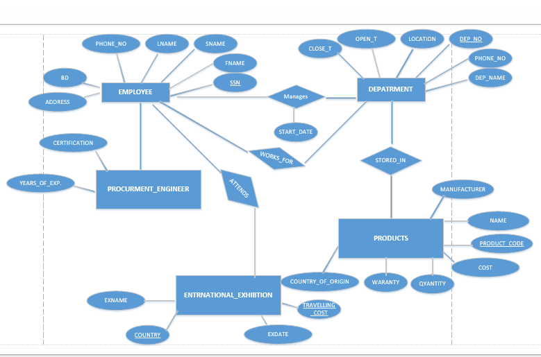

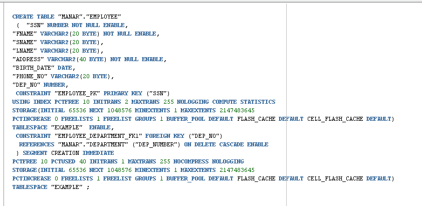

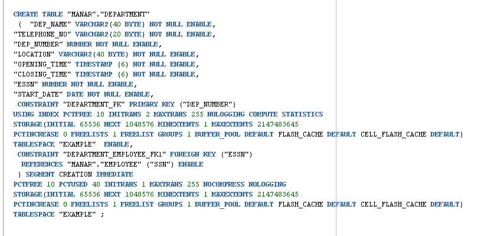

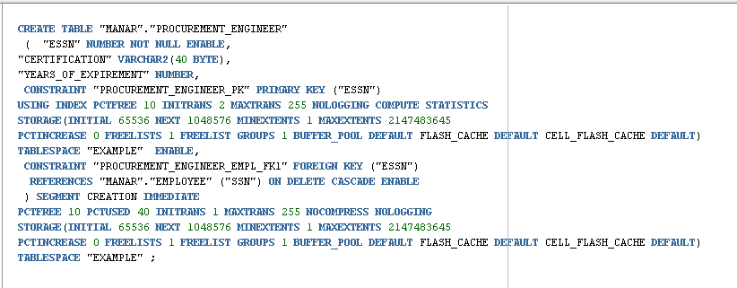

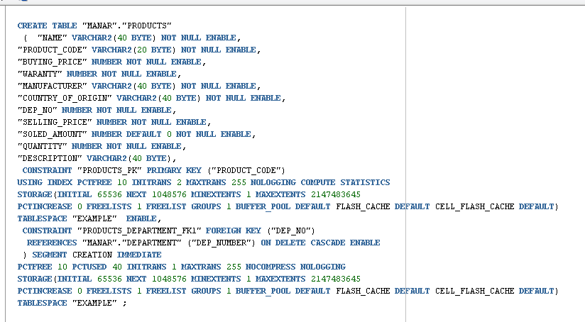

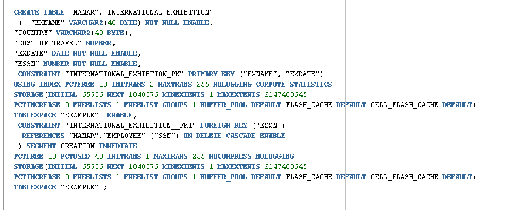

And for the users to log in:
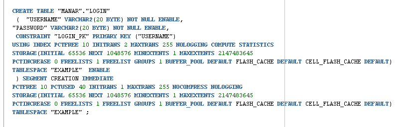
 
# Applications' Interface:
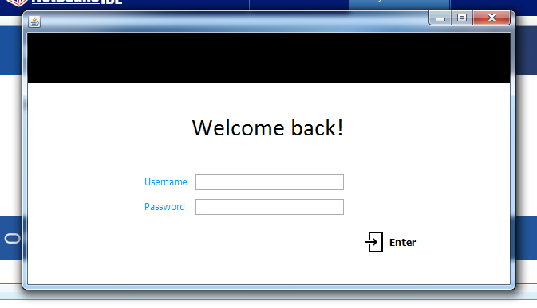

Our application runs first the login frame, where the user types in the right username and password –which is stored in the database- to get access to the rest of the application.
When entered, the user will get to see all information about employees, departments, products or international exhibitions by just clicking on the name of each and it will open a tab for it, we can move between these tabs by clicking on its name.
In each tab, the user has the ability to search by a specific field for a certain information and to order the data appearing by also specific fields that the user choose.
Inside each tab, the user also gets to add a new item or edit an existing one when clicking on the Add button or clicking on the item from table then the Edit button. In both ways, it will open up a new frame to fill the details of the added item or editing the existing ones. The user also gets the ability to delete an item by choosing it from the table shown and click on the Delete button.
There is a refresh button in every tab, and an extra button in the departments tab “Show Products”, it will get enabled after clicking on an item in the table so it can collect the data about this specific department, and by clicking on this button it will represent the products existing in this department on the table of products in this tab.
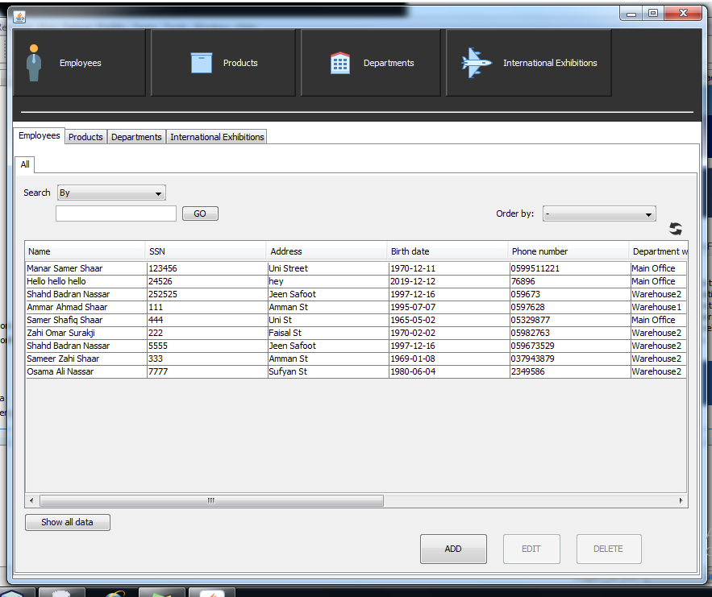

### Notes: 
* There’s a different frame for each Add/Edit button in each frame to represent the data needed to enter, for example:

Add in Departments:

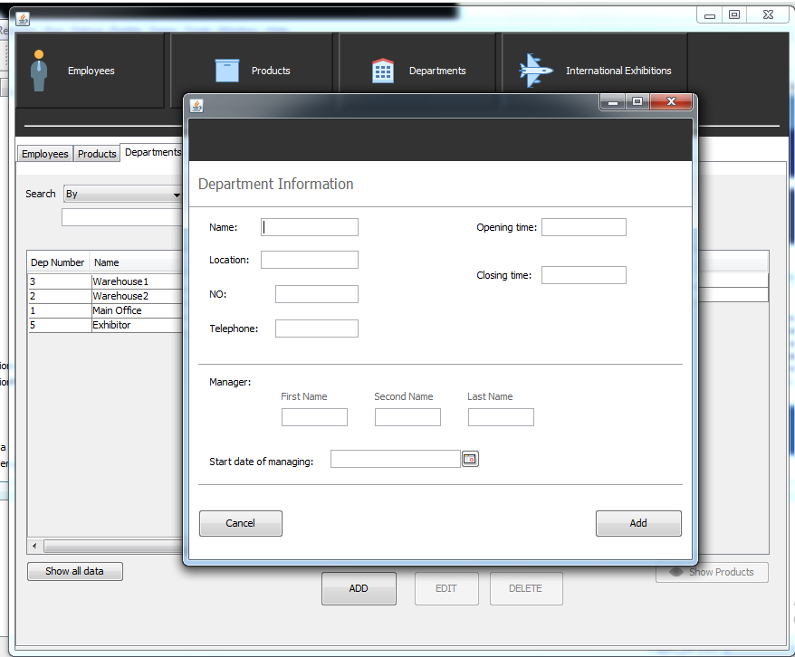

Add in Products:

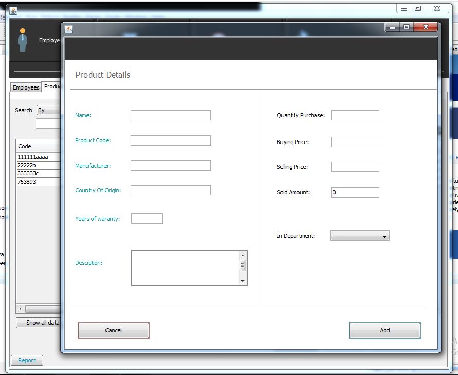

(Difference between the Edit and Add frames is just that the Edit frame would have initial data filled in it –to edit on it-).

* The Order by button works for two cases based on what’s shown on the table. 1) if it’s called after searching 2) and if it’s called after refreshing or the Show All button, as can be illustrated from the images below:

Ordering after refreshing:

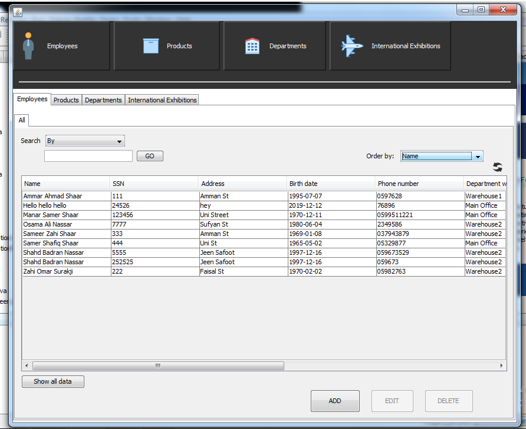

Searching:

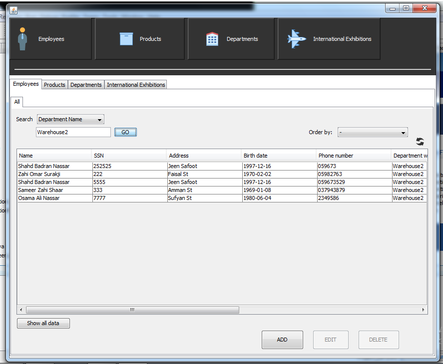

Ordering after searching:

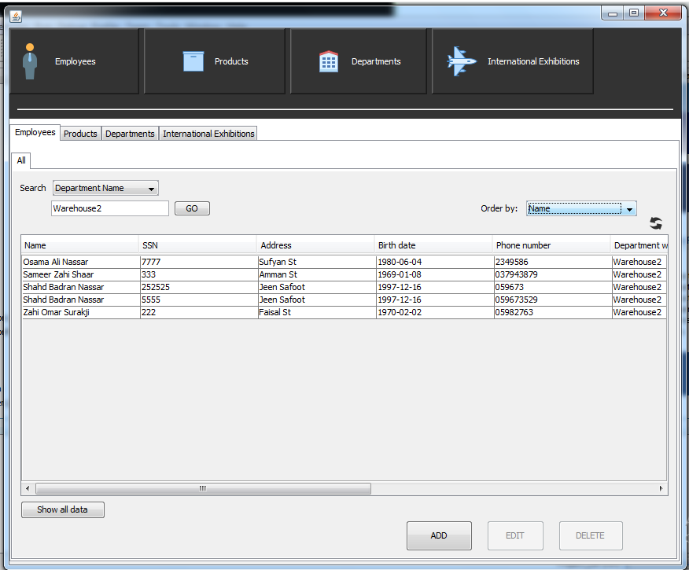

* At last, we used jasper report to create a report that takes data from two tables Department & Products and represent them, and illustrate the amount sold of each product by a chart.
(This report appears when the user press on the Report button in the product tab, and it will represent data stored by then).

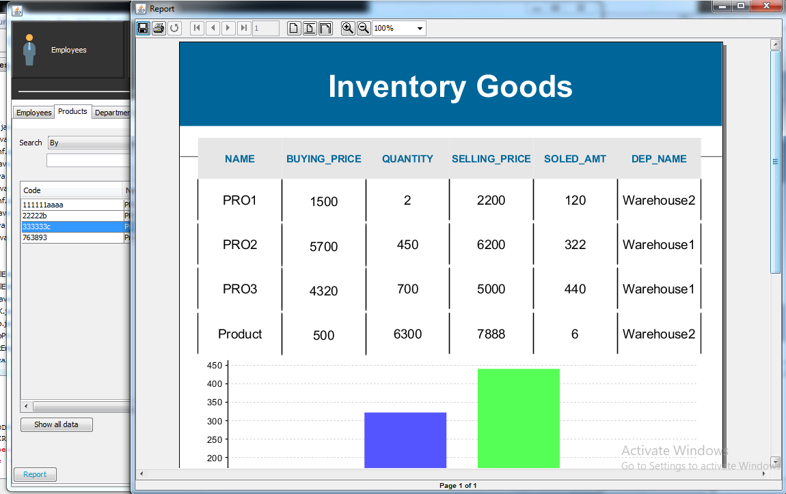

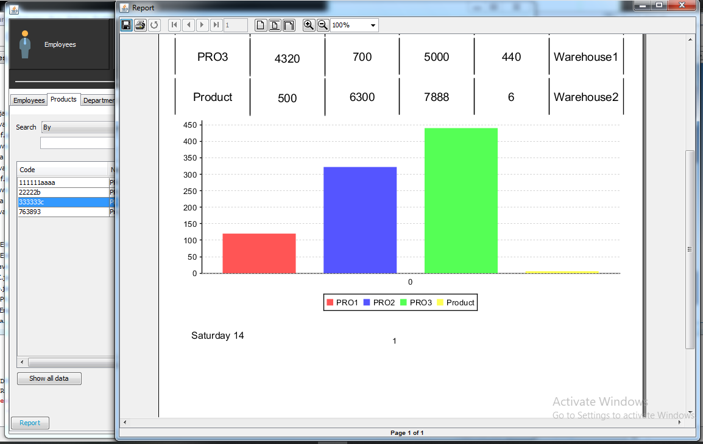

#### You can find other screenshots of the application while running in the images folder.
